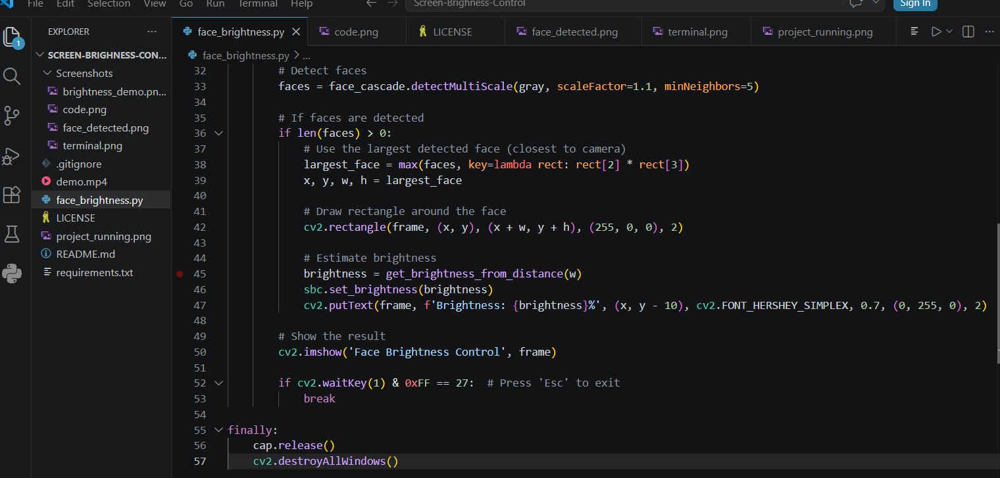
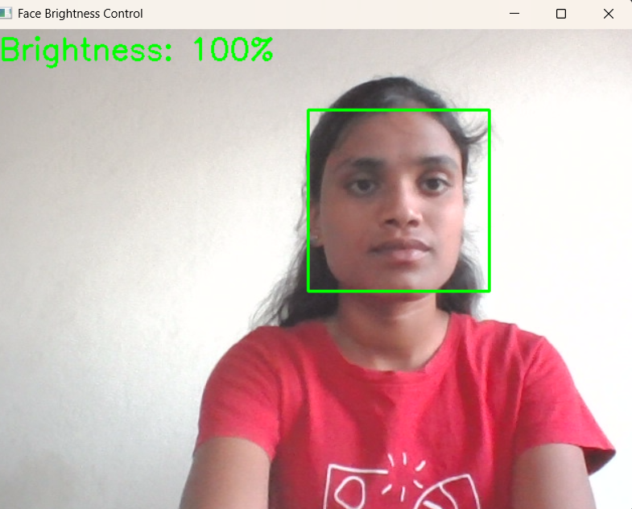
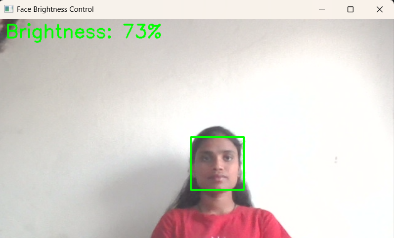
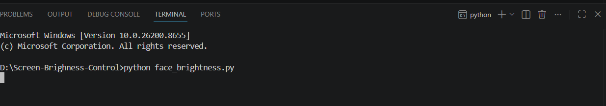

# Face Brightness Control Using Python and OpenCV

## Project Overview

Face Brightness Control is a real-time computer vision project developed using Python and OpenCV. The application detects the user's face through the webcam and automatically adjusts the screen brightness by estimating the user's distance from the camera using the detected face width. This provides a hands-free and comfortable viewing experience while demonstrating practical applications of computer vision and automation.

## Features

- Real-time face detection using OpenCV
- Automatic screen brightness adjustment
- Live webcam video processing
- Fast and lightweight implementation
- Easy to use and run

## Technologies Used

- Python
- OpenCV
- NumPy
- screen-brightness-control
- WMI
- pywin32

##  How It Works

1. Captures live video from the webcam.
2. Converts each frame into grayscale for faster face detection.
3. Detects the user's face using the Haar Cascade Classifier.
4. Selects the largest detected face.
5. Estimates the user's distance using the detected face width.
6. Calculates the appropriate screen brightness level.
7. Automatically updates the system screen brightness in real time.

## Project Structure

Face-Brightness-Control/
│
├── face_brightness.py
├── README.md
├── requirements.txt
├── .gitignore
├── LICENSE
├── screenshots/
└── demo

## Installation

### 1. Clone this repository
git clone
https://github.com/Bhargavi57gardas/Face-Brightness-Control.git

### 2. Install the required libraries

pip install -r requirements.txt

### 3. Run the project

python face_brightness.py

## Screenshots

## Screenshots

### Code Screenshot

### Face Detection

### Brightness Demonstration

### Terminal Output

##  Future Improvements

- Improve face distance estimation
- Add support for multiple faces
- Create a graphical user interface (GUI)
- Improve brightness adjustment accuracy
- Add cross-platform support

##  Author

**Bhargavi Gardas**

B.Tech – Artificial Intelligence and Data Science.

## Acknowledgement

This project was developed as part of my B.Tech in Artificial Intelligence and Data Science to gain practical experience in Python programming, Computer Vision, and real-time automation using OpenCV.
